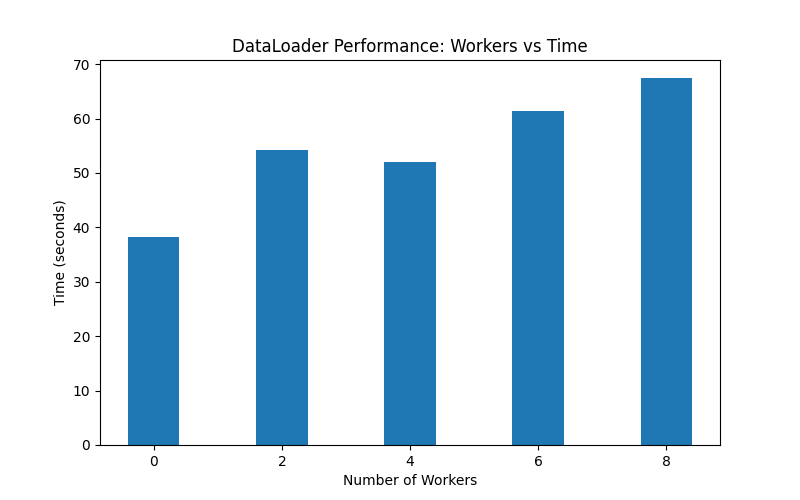

Project Title: PyTorch Data Fundamentals: Kaggle vs. Hugging Face.

This project is a image processing pipeline built with Pytorch.

# Key Features

## Data Loading
A unified interface to handle local directory Kaggle dataset and Hugging Face cloud dataset

## Performance Benchmarks
Conducted performance benchmarking to determine optimal num_workers configuration for dataloader

This graph shows the impact of `num_workers` on data loading time:


## Visualization
Created a utility to visualize the images in both the datasets

# Project Structure
```text
├── src/
│   ├── datasets.py      # Custom local ImageDataset class (Kaggle)
|   ├── __init__.py
│   ├── hf_pipeline.py   # Hugging Face Food-101 integration logic
│   └── utils.py         # Universal visualization & un-normalization tools
├── benchmarks/
│   └── test_workers.py  # Performance testing suite
├── train.py             # Main entry point (Dataset switching logic)
└── requirements.txt     # Dependency management
```

# Setup

1. Create a virtual environment using Python version: 3.12.6 and activate it
    virtualenv -p python3.12.6 <venv_name>
    source <venv_name>/bin/activate
2. Install required packages
    pip install -r requirements.txt
3. Run the code
    python train.py
